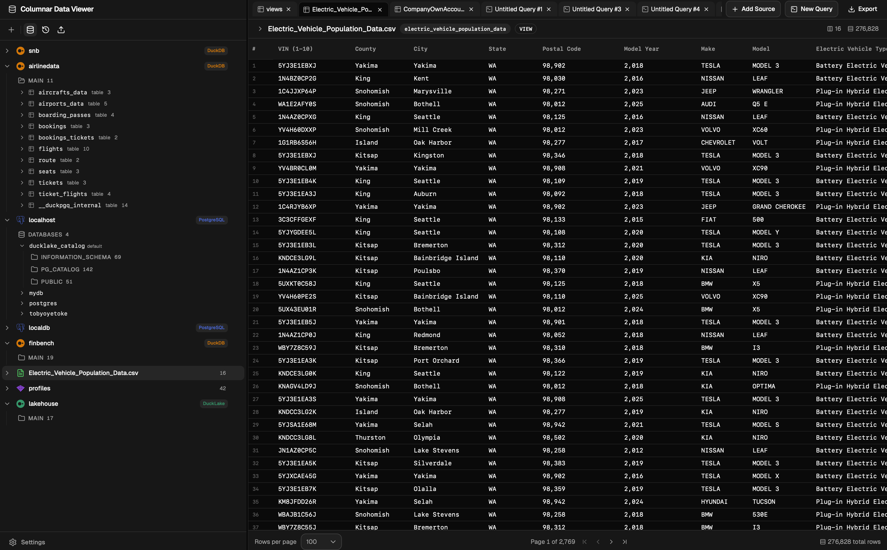
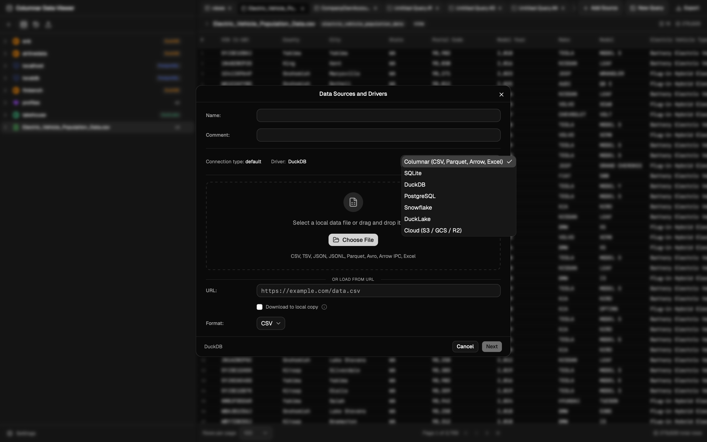

# CDV — Columnar Data Viewer

A desktop app for viewing and querying columnar data files — Parquet, Avro, Arrow IPC — alongside CSV, JSON, and Excel. Drop a file in, get a schema and a SQL editor. No server, no setup.

Under the hood it's DuckDB doing the work: files are registered as views (or optionally materialized into tables), and results travel to the frontend as Arrow IPC batches. CDV also connects to PostgreSQL, Snowflake, SQLite, other DuckDB databases, and DuckLake catalogs, so you can pull data from live systems into the same workspace.

Tauri v2 (Rust) backend, React + TypeScript frontend.



## Supported Data Formats

### Input

| Format | Extensions | Engine |
|------------|-------------------|---------------------------|
| Parquet | `.parquet` | `read_parquet()` |
| Avro | `.avro` | `read_avro()` |
| Arrow IPC | `.arrow`, `.ipc` | Direct reference |
| CSV | `.csv` | `read_csv_auto()` |
| TSV | `.tsv` | `read_csv_auto(delim='\t')` |
| JSON | `.json` | `read_json_auto()` |
| JSONL | `.jsonl` | `read_json_auto()` |
| Excel | `.xlsx` | `read_xlsx()` |

### Export

| Format | Output |
|---------|-----------------|
| CSV | `FORMAT csv` |
| Parquet | `FORMAT parquet` |
| JSON | `FORMAT json` |

### Cloud Storage

| Provider | Scheme | Auth |
|---------------------|--------|----------------------------------------------|
| Amazon S3 (+ compatible) | `s3://` | Access Key + Secret Key, optional endpoint |
| Google Cloud Storage | `gcs://` | Key ID + Secret |
| Cloudflare R2 | `s3://` | Account ID + Access Key + Secret Key |

### Database & Lakehouse Connectors

| Connector | How it works |
|------------|-----------------------------------------------|
| PostgreSQL | Attaches via ADBC, supports multiple databases |
| Snowflake | ADBC driver auto-downloaded on first connect |
| SQLite | Direct attach |
| DuckDB | Direct attach |
| DuckLake | Attaches as a DuckLake catalog |

## Features

### Data Source Management
- Add sources from local files (native file picker) or cloud connections
- Drag-and-drop file import
- Auto-format detection by extension with manual override
- Schema preview with column names, types, nullable, and primary key selection
- Materialize option — store as a DuckDB table for faster repeated access, or keep as a lazy view
- Update, reimport, or remove data sources
- Properties dialog with name, view name, path, format, row count, and full schema



### SQL Query Editor
- Monaco Editor with SQL language mode and dark theme
- Context-aware autocomplete — table names after `FROM`/`JOIN`, columns after `SELECT`/`WHERE`, dot-notation support
- Ctrl+Enter to execute
- Per-tab query state with debounced persistence

### Data Viewing
- Virtualized table (`@tanstack/react-table` + `@tanstack/react-virtual`) for smooth scrolling
- Column sorting and resizing
- Row numbering
- Type-aware rendering — NULL shown italic, booleans colored, numbers locale-formatted
- View modes: First 100, Last 100, All Rows, Filtered Rows

### Cloud Connections
- Create connections to S3, GCS, or Cloudflare R2 with credentials
- Browse remote files via `glob()` queries
- Import remote files directly as data sources

### Export
- Export query results to local file (CSV, Parquet, JSON)
- Native save dialog with customizable query before export

### Workspace & Tabs
- Multi-tab interface — data tabs (one per source) and query tabs (unlimited)
- Tab state persisted and restored across restarts

## Tech Stack

- Tauri (React, Tailwind, Rust)
- DuckDB
- Arrow

## Application Data (com.cdv.desktop)

| File | Purpose |
|------------------|----------------------------------------------|
| `cdv.duckdb` | Materialized tables persist across sessions |
| `catalog.json` | Data source metadata and connection records |
| `settings.json` | App preferences |
| `workspace.json` | Open tabs and active tab state |

All persisted in the OS app data directory. Falls back to in-memory DuckDB if the persistent database fails to open.

## Development

### Prerequisites

- [Rust](https://www.rust-lang.org/tools/install)
- [Bun](https://bun.sh/) (or Node.js)
- [Tauri CLI](https://v2.tauri.app/start/prerequisites/)

### Setup

```bash
bun install
bun tauri dev
```

### Build

```bash
bun tauri build
```

## Contributing

See [CONTRIBUTING.md](CONTRIBUTING.md).

## License

MIT — see [LICENSE](LICENSE).